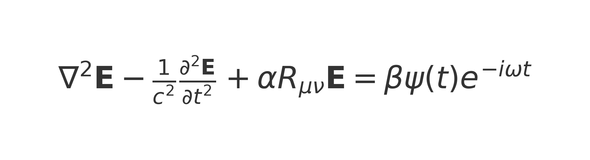
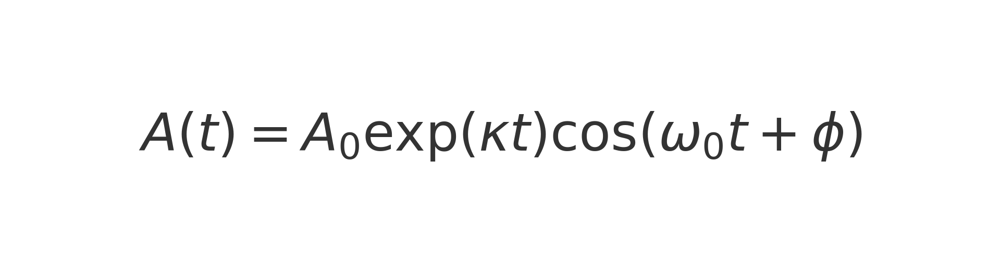

# Temporal Communication Through ELF Wave Resonance and Ancient Structures  

## Abstract  
This project explores the potential for leveraging Earth's extremely low-frequency (ELF) waves, cosmic alignments, and ancient resonant structures, such as pyramids, to facilitate communication across time. By integrating principles from general relativity, quantum mechanics, and resonance physics, this framework hypothesizes that pyramids may act as amplifiers and receivers for ELF signals influenced by spacetime curvature during planetary alignments.  

---

## 1. Theoretical Framework  

### 1.1 Spacetime Curvature and ELF Wave Propagation  
The Einstein field equations describe spacetime curvature induced by mass-energy:  
R_{μν} - (1/2) g_{μν} R = (8 π G / c^4) T_{μν}

  

Where:  
- **R_{μν}** – Ricci curvature tensor  
- **g_{μν}** – Metric tensor  
- **T_{μν}** – Stress-energy tensor  

The propagation of ELF waves in curved spacetime can be described by:  
∇² E - (1/c²) ∂²E/∂t² + α R_{μν} E = 0

Where **α R_{μν} E** represents the perturbation caused by spacetime curvature.  

---

### 1.2 Quantum Entanglement and ELF Modulation  
Entanglement dynamics follow the time-dependent Schrödinger equation:  
i ℏ (∂ψ/∂t) = Ĥ ψ

  

Where:  
- **ψ** – Quantum state  
- **Ĥ** – Hamiltonian (total energy operator)  

Time evolution of an entangled state:  
ψ(t) = exp(-i Ĥ t / ℏ) ψ(0)

In the presence of ELF modulation and spacetime curvature:  
i ℏ (∂ψ/∂t) = Ĥ ψ + γ E(t)

Where **γ E(t)** represents ELF-induced perturbation affecting the entangled state.  

---

### 1.3 Coupled System – Full Governing Equation  
Combining the effects of spacetime curvature, ELF wave propagation, and entanglement:  
∇² E - (1/c²) ∂²E/∂t² + α R_{μν} E = β ψ(t) exp(-i ω t)

  

Where:  
- **β** – Pyramid amplification factor representing material resonance  
- **ψ(t) exp(-i ω t)** – Quantum wave interacting with ELF waves  

---

### 2. Pyramid Resonance and ELF Amplification  
Pyramids may amplify ELF waves through resonance effects and piezoelectric properties:  
A(t) = A₀ exp(κ t) cos(ω₀ t + ϕ)

  

Where:  
- **A₀** – Initial amplitude of ELF waves  
- **κ** – Growth rate of pyramid resonance  
- **ω₀** – Resonant frequency (typically ~7.83 Hz for Schumann resonance)  
- **ϕ** – Phase shift due to cosmic alignment  

The amplification factor, **β**, is determined by:  
β = (Q / V) ⋅ χ

Where:  
- **Q** – Quality factor of the pyramid (resonance efficiency)  
- **V** – Volume of the resonant cavity  
- **χ** – Piezoelectric coupling coefficient of pyramid materials  

---

## 3. Experimental Design  

**Quantum Sensor Deployment**  
- Deploy quantum sensors and ELF detectors near pyramid sites.  
- Monitor Schumann resonance anomalies during planetary alignments.  

**Material Testing**  
- Test pyramid materials under controlled ELF waves for resonance behavior.  

---

## 4. Limitations and Considerations  
- **Quantum Decoherence** – Entangled states may degrade over time, limiting effectiveness.  
- **Environmental Noise** – ELF signals are sensitive to geomagnetic and atmospheric disturbances.  

---

## 5. Conclusion  
This project proposes a speculative yet structured approach to investigating temporal communication through ELF waves and ancient structures. By integrating quantum mechanics, resonance physics, and general relativity, it aims to explore the intersection of ancient technology and cutting-edge physics.  
