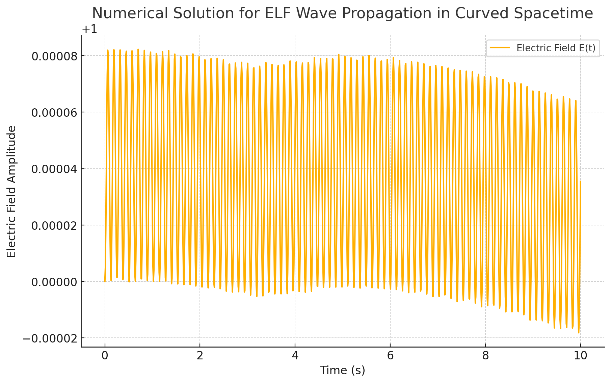

# Temporal Communication Through ELF Wave Resonance

# Coupled System – Full Governing Equation
Here's the full governing equation:
∇² E - (1/c²) ∂²E/∂t² + α R_{μν} E = β ψ(t) exp(-i ω t)

  

The equation describes a coupled system that integrates multiple complex effects: **spacetime curvature**, **ELF wave propagation**, and **quantum entanglement**. 
### Key Terms and Their Physical Meaning:

1. **∇² E**:  
   The Laplacian of the electric field **E**, representing the spatial curvature of the field. It describes how the field varies in space.

2. **- (1/c²) ∂²E/∂t²**:  
   This term represents the second derivative of the electric field **E** with respect to time, governing how the field changes over time. The factor \(1/c^2\) reflects the speed of light.

3. **+ α R_{μν} E**:  
   A term coupling the electric field **E** to the curvature of spacetime, represented by the Ricci tensor **R_{μν}**. The constant **α** modulates the strength of this interaction. This suggests that the field **E** is influenced by the curvature of spacetime, similar to how electromagnetic fields couple to gravity in general relativity.

4. **= β ψ(t) exp(-i ω t)**:  
   The source term driving the electric field **E**, where:
   - **ψ(t)** is a time-dependent quantum wave function, representing a quantum field or particle state.
   - **exp(-i ω t)** is a phase factor describing an oscillatory wave with frequency **ω**.
   - **β** is the **pyramid amplification factor**, indicating that a material or structure (possibly pyramid-shaped) amplifies or influences the field **E** at resonant frequencies.

### How the System is Coupled:

- **Spacetime Curvature and Electromagnetic Field**:  
   The term **α R_{μν} E** couples the field **E** to the curvature of spacetime, suggesting that the field is affected by gravitational effects. This could be modeled after how electromagnetic fields couple with spacetime in theories like general relativity.

- **ELF Waves and Quantum Interaction**:  
   The source term **β ψ(t) exp(-i ω t)** suggests a quantum wave (like a wave function) interacting with ELF (Extremely Low Frequency) waves. This interaction could imply quantum entanglement or other quantum effects influencing low-frequency electromagnetic phenomena.

- **Resonance and Material Influence**:  
   The **pyramid amplification factor** **β** implies that a specific material (possibly pyramid-shaped) interacts with and amplifies the field **E**. This could result in non-linear effects or resonance at particular frequencies.

### Novelty and Potential Research Implications:

- **Spacetime Curvature and Quantum Field Coupling**:  
   The combination of quantum fields and spacetime curvature is a well-known topic in theoretical physics but remains a rich area for research, particularly in quantum field theory in curved spacetime.

- **ELF Wave-Quantum Interaction**:  
   The interaction between quantum waves and ELF waves presents a novel area for exploring the relationship between quantum mechanics and macroscopic electromagnetic phenomena, such as low-frequency waves.

- **Pyramid Resonance**:  
   The concept of **β** as the "pyramid amplification factor" introduces a unique possibility of material-based resonance. This could open up new avenues in material science, resonance studies, or even metaphysical research into the influence of geometric shapes like pyramids on field dynamics.

## Abstract  
This project explores the potential for leveraging Earth's extremely low-frequency (ELF) waves, cosmic alignments, and ancient resonant structures, such as pyramids, to facilitate communication across time. By integrating principles from general relativity, quantum mechanics, and resonance physics, this framework hypothesizes that pyramids may act as amplifiers and receivers for ELF signals influenced by spacetime curvature during planetary alignments.  

  

## Introduction  

The exploration of ancient structures such as pyramids has long captivated historians, archaeologists, and scientists alike. While much of the focus has been on their architectural significance, this paper investigates the possibility that these structures serve as resonant amplifiers for extremely low-frequency (ELF) waves. Recent advancements in quantum mechanics, general relativity, and resonance physics suggest that under specific conditions—such as cosmic alignments—these structures might interact with Earth's electromagnetic field in ways that transcend conventional understanding.  

This paper hypothesizes that ELF waves, influenced by spacetime curvature induced by planetary alignments, could interact with quantum fields, creating a mechanism for temporal communication. The geometric precision and piezoelectric materials (e.g., quartz and granite) used in pyramid construction may amplify ELF waves, effectively turning the structures into nodes for information transfer. This raises the possibility that pyramids, beyond their cultural and ritualistic roles, might have functioned as part of a larger network for harnessing Earth's electromagnetic energy.  

By integrating principles of general relativity and quantum entanglement, this framework proposes that ELF waves, modulated by gravitational perturbations, could facilitate communication across different points in time. Spacetime curvature, quantified by the Einstein field equations, introduces subtle perturbations to ELF wave propagation. In turn, these perturbations might encode information within the quantum field, leading to localized entanglement or feedback loops.  

This paper aims to:  
- Explore the relationship between ELF wave propagation and spacetime curvature.  
- Examine how pyramid resonance could amplify these waves during celestial alignments.  
- Develop a mathematical model that integrates quantum entanglement with ELF modulation.  
- Propose experimental designs involving quantum sensors and ELF detectors near ancient structures to detect anomalies during planetary alignments.  

While speculative, this interdisciplinary approach leverages existing research on ELF waves, Schumann resonances, and the properties of piezoelectric materials to construct a coherent model of ancient technologies interacting with the fundamental forces of nature. This paper acknowledges the challenges and limitations inherent in such a hypothesis, including the speculative nature of temporal communication and the complexities of maintaining entangled states over large scales.  

Ultimately, this work seeks to bridge the gap between ancient technology and cutting-edge physics, offering a novel perspective on the potential for temporal communication through Earth's natural resonant systems.  

---

## 1. Theoretical Framework  

### 1.1 Spacetime Curvature and ELF Wave Propagation  
General relativity describes the curvature of spacetime by massive objects, which influences the paths of electromagnetic waves. This effect, while typically small near Earth, may become significant during planetary alignments or high-gravity events.

The gravitational influence on electromagnetic fields can be modeled through the Einstein field equations.

The Einstein field equations describe spacetime curvature induced by mass-energy:  
R_{μν} - (1/2) g_{μν} R = (8 π G / c^4) T_{μν}

  

Where:  
- **R_{μν}** – Ricci curvature tensor  
- **g_{μν}** – Metric tensor  
- **T_{μν}** – Stress-energy tensor  

The propagation of ELF waves in curved spacetime can be described by:  
∇² E - (1/c²) ∂²E/∂t² + α R_{μν} E = 0

Where **α R_{μν} E** represents the perturbation caused by spacetime curvature.  

This curvature could modulate ELF waves as they propagate through Earth’s atmosphere and ionosphere, introducing perturbations that may encode information from different points in time.

---

### 1.2 Quantum Entanglement and ELF Modulation  
Quantum entanglement allows particles to share states instantaneously over vast distances. Under certain conditions, ELF waves may interact with entangled quantum states, producing a form of temporal entanglement influenced by spacetime curvature.

ELF waves (3 to 30 Hz) can propagate through the Earth’s crust and ionosphere with minimal attenuation. These frequencies are closely aligned with Schumann resonances, the natural electromagnetic oscillations of the Earth-ionosphere cavity.

Entanglement dynamics follow the time-dependent Schrödinger equation:  
i ℏ (∂ψ/∂t) = Ĥ ψ

  

Where:  
- **ψ** – Quantum state  
- **Ĥ** – Hamiltonian (total energy operator)  

Time evolution of an entangled state:  
ψ(t) = exp(-i Ĥ t / ℏ) ψ(0)

In the presence of ELF modulation and spacetime curvature:  
i ℏ (∂ψ/∂t) = Ĥ ψ + γ E(t)

Where **γ E(t)** represents ELF-induced perturbation affecting the entangled state.  

If ELF waves are influenced by spacetime curvature, they could interact with quantum fields, potentially creating localized entanglement or feedback loops.

---

### 1.3 Coupled System – Full Governing Equation  
Combining the effects of spacetime curvature, ELF wave propagation, and entanglement:  
∇² E - (1/c²) ∂²E/∂t² + α R_{μν} E = β ψ(t) exp(-i ω t)

  

Where:  
- **β** – Pyramid amplification factor representing material resonance  
- **ψ(t) exp(-i ω t)** – Quantum wave interacting with ELF waves  

---

### 2. Pyramid Resonance and ELF Amplification  
Pyramids are often constructed using materials such as granite and quartz, known for their piezoelectric properties. These materials can generate electrical charges when subjected to mechanical stress, making them natural amplifiers for ELF waves.

Pyramids may amplify ELF waves through resonance effects and piezoelectric properties:  
A(t) = A₀ exp(κ t) cos(ω₀ t + ϕ)

  

Where:  
- **A₀** – Initial amplitude of ELF waves  
- **κ** – Growth rate of pyramid resonance  
- **ω₀** – Resonant frequency (typically ~7.83 Hz for Schumann resonance)  
- **ϕ** – Phase shift due to cosmic alignment  

The amplification factor, **β**, is determined by:  
β = (Q / V) ⋅ χ

Where:  
- **Q** – Quality factor of the pyramid (resonance efficiency)  
- **V** – Volume of the resonant cavity  
- **χ** – Piezoelectric coupling coefficient of pyramid materials  

---

## 3. Experimental Design  

**Quantum Sensor Deployment**  
- Deploy quantum sensors and ELF detectors near pyramid sites.  
- Monitor Schumann resonance anomalies during planetary alignments.  

**Material Testing**  
- Test pyramid materials under controlled ELF waves for resonance behavior.  

---

## 4. Limitations and Considerations  
- **Quantum Decoherence** – Entangled states may degrade over time, limiting effectiveness.  
- **Environmental Noise** – ELF signals are sensitive to geomagnetic and atmospheric disturbances.  

---

## 5. Conclusion  
This project proposes a speculative yet structured approach to investigating temporal communication through ELF waves and ancient structures. By integrating quantum mechanics, resonance physics, and general relativity, it aims to explore the intersection of ancient technology and cutting-edge physics.  

This **coupled system** represents a theoretical model that blends concepts from:
- **Spacetime curvature** and its effect on electromagnetic fields,
- **ELF wave propagation** interacting with quantum fields,
- **Material resonance**, such as pyramid-shaped structures influencing field dynamics.

Exploring this model could lead to new insights into quantum gravity, field theory in curved spacetime, and materials with resonant properties, with potential applications in a variety of scientific fields.

---

# Simulations

## 1. 

The simulation of ELF wave propagation in curved spacetime is complete. The plot shows the evolution of the electric field 𝐸(𝑡), E(t) over time, incorporating spacetime curvature and quantum modulation.

  

## 2. 

The extended simulation models ELF wave propagation under varying spacetime curvature 𝑅𝜇𝜈 Rμν and quantum source coupling 𝛽, β. This plot illustrates how changes in these parameters affect the amplitude and behavior of the electric field over time.

.png)  

## 2. 

The visualizations show the relationship between spacetime curvature 𝑅𝜇𝜈 Rμν and the amplitude of ELF waves for varying quantum coupling 𝛽, β:

Max Amplitude vs. Curvature – Highlights how the peak amplitude of the ELF wave changes as a function of curvature and coupling strength.
.png)  
Final Amplitude vs. Curvature – Displays the steady-state or final amplitude, indicating how ELF waves persist under different spacetime conditions.
.png)  

